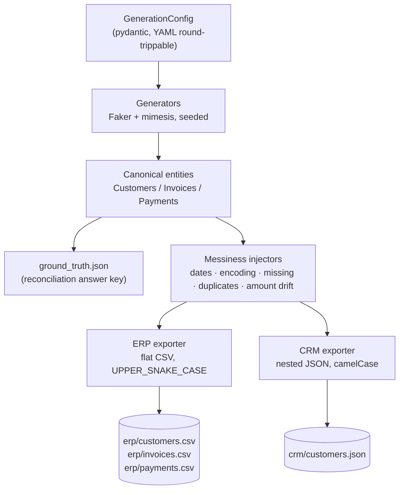
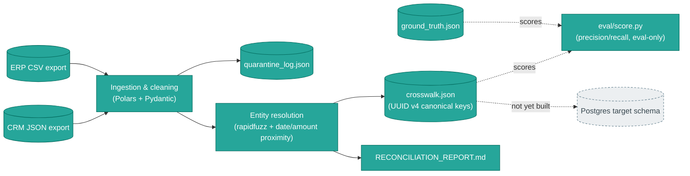
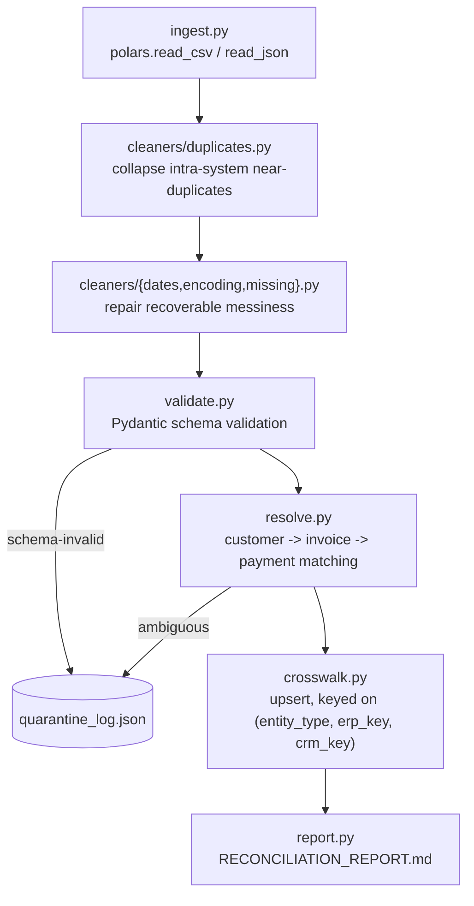

# Architecture

## Why two divergent exports instead of one clean dataset?

A reconciliation pipeline is only as good as the messy data it's tested
against. Real ERP and CRM systems almost never agree on field names, ID
formats, or even which records exist -- that's exactly the kind of
divergence this tool reproduces on purpose.

|               | ERP export                                                             | CRM export                                                      |
| ------------- | ---------------------------------------------------------------------- | --------------------------------------------------------------- |
| Format        | Flat CSV (`erp/customers.csv`, `erp/invoices.csv`, `erp/payments.csv`) | Nested JSON (`crm/customers.json`)                              |
| Field naming  | Legacy `UPPER_SNAKE_CASE` (`CUST_ID`, `INV_NO`)                        | `camelCase` (`customerId`, `invoiceNumber`)                     |
| Business keys | `C000001`, `INV-000001`, `PMT-000001`                                  | `CUST-000001`, `INV000001`, `PAY000001`                         |
| Structure     | One row per invoice/payment                                            | Invoices nest under customers, and payments nest under invoices |

Both exports are projections of the same internal, seeded "ground truth"
entities, so a correct reconciliation pipeline should be able to match them
back together despite the different formats.

## Data generation pipeline



**Design principle:** the generators decide structural cross-system
discrepancies once -- for example, a record existing in only one system, or
a payment amount that legitimately differs between systems -- because that
decision requires knowledge of _both_ systems at once. `datagen.messiness`
then applies cosmetic messiness (bad date formats, missing values, encoding
issues, duplicate rows) independently per export, so the ERP and CRM copies
of the same data diverge realistically instead of matching each other's
corruption exactly.

All randomness -- including internal correlation UUIDs -- derives from a
single master seed via
[`numpy.random.SeedSequence.spawn`](reference/api.md#datagen.rng), so
reproducibility doesn't depend on any OS-level randomness.

## Module layout

```text
src/datagen/
  config.py           GenerationConfig / MessinessConfig
  identities.py        Canonical ("ground truth") entity models
  rng.py                Seeded RNG helpers (independent, reproducible streams)
  keys.py               Business-facing ID formatting, divergent per system
  generators/           Faker/mimesis-based entity generation
  messiness/            Cosmetic "messy data" injection (pandas-based, composable)
  exporters/            System-specific projection + serialization
  ground_truth.py       Reconciliation answer-key mapping (JSON)
  cli.py                Typer CLI
```

## Where this fits in the larger pipeline

Dataset generation (`src/datagen/`) is step one: it produces the messy
ERP/CRM exports and, optionally, the `ground_truth.json` answer key. Step
two is the reconciliation pipeline (`src/pipeline/`), which ingests those
exports, cleans and validates them, resolves ERP records against CRM
records, and produces a crosswalk plus a Markdown reconciliation report.



Run both stages together:

```bash
uv run datagen generate --seed 42 --customers 200 --with-ground-truth --output-dir data
uv run reconcile data
```

See the [pipeline architecture](#reconciliation-pipeline-architecture)
section below for the module layout, and the [CLI reference](reference/cli.md)
for the full `reconcile` flag list.

## Reconciliation pipeline architecture



```text
src/pipeline/
  models.py             CleanCustomer/Invoice/Payment, QuarantineEntry, CrosswalkEntry, ReasonCode
  ingest.py              Reads raw ERP CSV / CRM JSON into polars DataFrames
  cleaners/
    duplicates.py          Collapses intra-system near-duplicate rows
    dates.py                 Parses every known date format the generator can produce
    encoding.py                Repairs mojibake back to UTF-8
    missing.py                  Per-field missing-value policy (quarantine vs. null)
  validate.py            Pydantic validation into Clean* models or a QuarantineEntry
  resolve.py             Entity resolution: customers (fuzzy), invoices/payments (exact + proximity)
  crosswalk.py           Idempotent crosswalk persistence (JSON, pre-Postgres)
  quarantine.py          Quarantine log persistence (JSON)
  report.py              Markdown reconciliation report
  orchestrate.py         Shared ingest -> dedupe -> validate -> resolve sequence
  cli.py                 `reconcile` Typer CLI

eval/
  score.py               The only module allowed to read ground_truth.json --
                          computes precision/recall/F1, never consulted at runtime by src/pipeline/
```

### Surrogate keys vs. business keys

The crosswalk's `canonical_id` is a UUID v4 minted fresh at resolution time
(see [`pipeline.crosswalk`](reference/api.md#pipeline.crosswalk)) -- it
never reuses the generator's internal `customer_id` UUIDs from
[`identities.py`](reference/api.md#datagen.identities), which a real
pipeline never sees. Each crosswalk row still carries the source business
keys (`erp_key` / `crm_key`, nullable) alongside the surrogate ID, so
downstream joins, audits, and scoring against `ground_truth.json` have
something to match on.

**Entity resolution itself never relies on business-key format
correlation.** `CUST_ID` (ERP) and `customerId` (CRM) are cosmetically
different encodings of the same sequence number only because this is a
synthetic dataset -- see the note in
[`keys.py`](reference/api.md#datagen.keys) suggesting a pipeline "could" be
built to match them by normalizing digits. `pipeline.resolve` deliberately
does not do this: it matches customers on fuzzy name similarity
(`rapidfuzz`) combined with normalized email/phone comparison, and matches
invoices/payments within an already-resolved customer/invoice by date and
amount proximity instead. Business keys are used only as stable
identifiers _within_ a single system, never as the cross-system join key --
see [`pipeline.resolve`](reference/api.md#pipeline.resolve) and the
[data model reference](reference/data-model.md#entity-resolution-never-uses-id-format-shortcuts)
for the full rationale.
