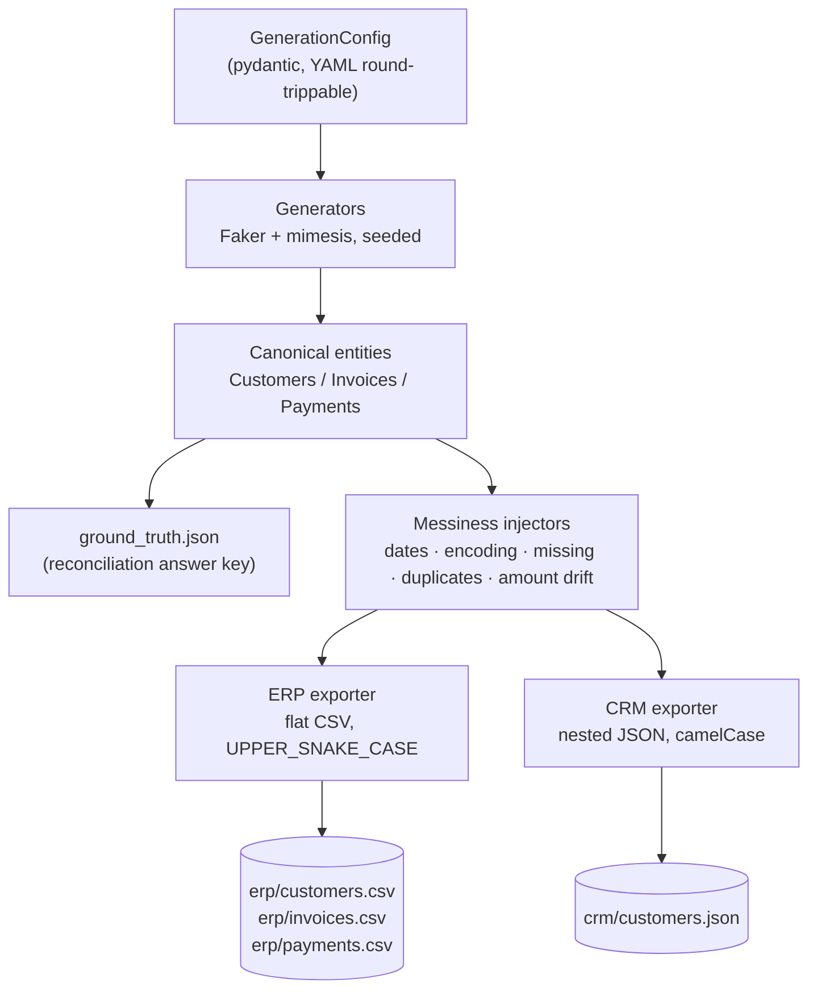
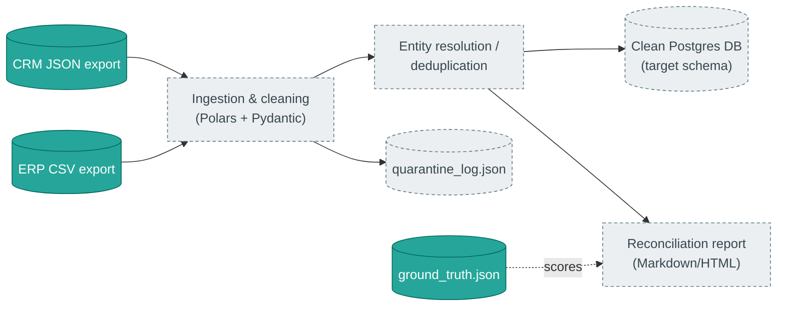

# Architecture

## Why two divergent exports instead of one clean dataset?

A reconciliation pipeline is only as good as the messy data it's tested
against. Real ERP and CRM systems almost never agree on field names, ID
formats, or even which records exist -- that's exactly the kind of
divergence this tool reproduces on purpose.

| |  ERP export | CRM export |
| --- | --- | --- |
| Format | Flat CSV (`erp/customers.csv`, `erp/invoices.csv`, `erp/payments.csv`) | Nested JSON (`crm/customers.json`) |
| Field naming | Legacy `UPPER_SNAKE_CASE` (`CUST_ID`, `INV_NO`) | `camelCase` (`customerId`, `invoiceNumber`) |
| Business keys | `C000001`, `INV-000001`, `PMT-000001` | `CUST-000001`, `INV000001`, `PAY000001` |
| Structure | One row per invoice/payment | Invoices nested under customers; payments nested under invoices |

Both exports are projections of the same internal, seeded "ground truth"
entities, so a correct reconciliation pipeline should be able to match them
back together despite the different formats.

## Data generation pipeline



**Design principle:** structural cross-system discrepancies (a record
existing in only one system, or a payment amount that legitimately differs
between systems) are decided once, in the generators, since they require
knowledge of *both* systems at once. Cosmetic messiness (bad date formats,
missing values, encoding issues, duplicate rows) is applied independently,
per export, in `datagen.messiness` -- so the ERP and CRM copies of the same
data diverge realistically instead of being corrupted identically.

Reproducibility is achieved by deriving all randomness -- including internal
correlation UUIDs -- from a single master seed via
[`numpy.random.SeedSequence.spawn`](reference/api.md#datagen.rng), rather
than relying on any OS-level randomness.

## Module layout

```text
src/datagen/
  config.py           GenerationConfig / MessinessConfig
  identities.py        Canonical ("ground truth") entity models
  rng.py                Seeded RNG helpers (independent, reproducible streams)
  keys.py               Business-facing ID formatting, divergent per system
  generators/           Faker/mimesis-based entity generation
  messiness/            Cosmetic "messy data" injection (pandas-based, composable)
  exporters/            System-specific projection + serialization
  ground_truth.py       Reconciliation answer-key mapping (JSON)
  cli.py                Typer CLI
```

## Where this fits in the larger pipeline

Dataset generation is the foundation for a broader **Legacy ERP/CRM
Integration & Data Cleaning Pipeline**. The pieces below this line are not
yet built; solid boxes are implemented, dashed boxes are planned.


